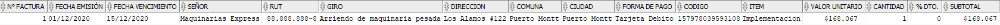

# Developer Test for LocalShop
### 1- Describe the process you have for a programming task(from requirements to delivery).
```
My process while programming: 

- Initially I analyze the task that I'm working on and try to define input and output data for it.

- If it's a complex task, I usually write steps that I need to solve the task before I code it,
  that help me a lot to understand the whole problem and find the best solution.
  
- When I'm coding I leave a comment next to the most important lines or functions explaining what it does.

- After programming, I test the solution with static parameters or any other method according to the type of task.
  All that include thinking about possible bugs that I can solve to optimize the task.
```
### 2- Databases are the most common way to storage data in complex aplications, these days are different types of them separated in relational databases(SQL) and non-relational databases explain the good vs bad about them and in wich case you will use one or another.
```
SQL: Tables have direct relations using PK and FK. Allow an easy and fast way to relate data but a slower way to read it.
SQL is better for write data but not for read it.

SQL can be used business purpose when you need to analize information and do Business Inteligence, 
also it can be used for companies that need to keep a consistent data structure.

NO-SQL: Doesn't have direct relations but allow something similar imitating direct relations. 
Developer has the responsability when he need to join information. NO-SQL is god at reading data but not for writing.

NO-SQL can be used for Web Development just like SQL, also it can be used for Mobile Development and 
Big Data due to the large amount of data that need to be managed.
```
### 3- Grab any invoice and create a database to store the data on it, create the entity diagram and database dictionary too.
#### Invoice image (Google)

#### Diagram

### Database dictionary


### 4- Someone ask you to create a webapp to chat with clients, this should support Whatsapp and Facebook Messenger, Which architecture and technologies will you use?(please add a diagraman in your answer)
```
```
### 5- What is your process to test and find bugs in an application?
```
In my test process I always try to force every single function, variable or validation introducing different types of data to forms ,
inputs and all types of elements that the application has to ensure that every functionality works according to requeriments.
```
### 6- What do you know about Cloud Computing?
```
Cloud computing bring us on demand virtualized resources that we can access through internet (Compute services (AWS EC2), Storage and networking services).
Cloud computing it's conformed by IAAS (Example: Virtual Machines,Hosting a complete infrastructure:AWS, Azure), PAAS(Examples: Platforms to build on: Heroku), SAAS(Software: Gmail, Drive)
```
### 7- What do you know about Agile software development process?
```
Agile methodology works with iterative development and continuous collaboration with the client also allow flexibility to adapt the project and its requirements.
```
### 8- remember question number 3?. Create a query to obtain all data from the tables you create to store invoice data
#### To create models
```sql
CREATE TABLE CIUDAD(
ID_CIUDAD NUMBER(3) PRIMARY KEY,
DESCRIP VARCHAR2(50) NOT NULL);

CREATE TABLE COMUNA(
ID_COMUNA NUMBER(3) PRIMARY KEY,
DESCRIP VARCHAR2(50) NOT NULL,
ID_CIUDAD NUMBER(3) NOT NULL CONSTRAINT COMUNA_CIUDAD_FK REFERENCES CIUDAD(ID_CIUDAD));

CREATE TABLE DIRECCION(
ID_DIR NUMBER(9) PRIMARY KEY,
DIRECCION VARCHAR2(50) NOT NULL,
ID_COMUNA NUMBER(3) NOT NULL CONSTRAINT DIR_COMUNA_FK REFERENCES COMUNA (ID_COMUNA)
);

CREATE TABLE CLIENTE(
ID_CLIENTE NUMBER(9) PRIMARY KEY,
NOMBRE_CLI VARCHAR2(30) NOT NULL,
RUT_CLI NUMBER(8) NOT NULL,
DV_CLI VARCHAR2(1) NOT NULL,
GIRO_CLI VARCHAR2(50) NOT NULL,
ID_DIR NOT NULL CONSTRAINT CLI_DIR_FK REFERENCES DIRECCION (ID_DIR)
);

CREATE TABLE PAGO(
ID_PAGO NUMBER(2) PRIMARY KEY,
DESCRIP VARCHAR2(20) NOT NULL
);

CREATE TABLE FACTURA(
ID_FACTURA NUMBER(9) PRIMARY KEY,
FEC_EMI DATE DEFAULT (SYSDATE) NOT NULL,
FEC_VEN DATE NOT NULL,
ID_PAGO NUMBER(2) NOT NULL CONSTRAINT FACT_PAGO_FK REFERENCES PAGO(ID_PAGO),
ID_CLIENTE NUMBER(9) NOT NULL CONSTRAINT FACT_CLI_FK REFERENCES CLIENTE(ID_CLIENTE)
);

CREATE TABLE ITEM(
ID_ITEM NUMBER(15) PRIMARY KEY,
NOMBRE_ITEM VARCHAR2(50) NOT NULL,
P_UNITARIO NUMBER(9) NOT NULL
);

CREATE TABLE DETALLE_FACTURA(
ID_FACTURA NUMBER(9) NOT NULL CONSTRAINT DF_FACT_PFK REFERENCES FACTURA(ID_FACTURA) ON DELETE CASCADE,
ID_ITEM NUMBER(15) NOT NULL  CONSTRAINT DF_ITEM_PFK REFERENCES ITEM(ID_ITEM) ON DELETE CASCADE,
CANTIDAD NUMBER(3) NOT NULL,
PORC_DCTO NUMBER(3,2) NOT NULL,
SUB_TOTAL NUMBER(10) NOT NULL,
CONSTRAINT FACT_ITEM_PK PRIMARY KEY (ID_FACTURA,ID_ITEM)
);
```
#### To populate
```sql
INSERT INTO CIUDAD 
VALUES(001,'Puerto Montt');

INSERT INTO COMUNA 
VALUES(001,'Puerto Montt',001);

INSERT INTO DIRECCION
VALUES(000000001,'Los Alamos #122', 001);

INSERT INTO CLIENTE
VALUES (000000001,'Maquinarias Express',88888888,'8','Arriendo de maquinaria pesada',000000001);

INSERT INTO PAGO
VALUES(01,'Tarjeta Debito');

INSERT INTO FACTURA
VALUES(000000001,TO_DATE('01-12-2020','dd-MM-yyyy'),TO_DATE('15-12-2020','dd-MM-yyyy'),01,000000001);

INSERT INTO ITEM
VALUES(157978039593108,'Implementacion',168067);

INSERT INTO DETALLE_FACTURA
VALUES(000000001, 157978039593108,1,0.0,168067);

```
#### Oracle query.
```sql
SELECT FAC.ID_FACTURA AS "N° FACTURA",TO_CHAR(FAC.FEC_EMI,'dd/MM/yyyy') AS "FECHA EMISIÓN",TO_CHAR(FAC.FEC_VEN,'dd/MM/yyyy') AS "FECHA VENCIMIENTO" ,CLI.NOMBRE_CLI AS "SEÑOR",TO_CHAR( CLI.RUT_CLI,'99G999G999')||'-'||CLI.DV_CLI AS "RUT", CLI.GIRO_CLI AS "GIRO",DIR.DIRECCION,
COMU.DESCRIP AS COMUNA,CIU.DESCRIP AS "CIUDAD",PA.DESCRIP AS "FORMA DE PAGO", DF.ID_ITEM AS "CODIGO",IT.NOMBRE_ITEM AS "ITEM",TO_CHAR(IT.P_UNITARIO,'$999g999g999') AS "VALOR UNITARIO",DF.CANTIDAD, DF.PORC_DCTO AS "% DTO.", TO_CHAR(DF.SUB_TOTAL,'$999g999g999') AS "SUBTOTAL" FROM
CLIENTE CLI JOIN FACTURA FAC
ON CLI.ID_CLIENTE = FAC.ID_CLIENTE
JOIN DIRECCION DIR
ON CLI.ID_DIR=DIR.ID_DIR
JOIN COMUNA COMU
ON DIR.ID_COMUNA=COMU.ID_COMUNA
JOIN CIUDAD CIU
ON COMU.ID_CIUDAD=CIU.ID_CIUDAD
JOIN PAGO PA
ON FAC.ID_PAGO=PA.ID_PAGO
JOIN DETALLE_FACTURA DF
ON FAC.ID_FACTURA=DF.ID_FACTURA
JOIN ITEM IT
ON DF.ID_ITEM=IT.ID_ITEM;
```
#### Results (ORACLE outputs)
```
N° FACTURA FECHA EMIS FECHA VENC SEÑOR                          RUT           GIRO                                               DIRECCION                                          COMUNA                                             CIUDAD                                             FORMA DE PAGO            CODIGO ITEM                                               VALOR UNITARI   CANTIDAD     % DTO. SUBTOTAL     
---------- ---------- ---------- ------------------------------ ------------- -------------------------------------------------- -------------------------------------------------- -------------------------------------------------- -------------------------------------------------- -------------------- --------------- -------------------------------------------------- ------------- ---------- ---------- -------------
         1 01/12/2020 15/12/2020 Maquinarias Express             88.888.888-8 Arriendo de maquinaria pesada                      Los Alamos #122                                    Puerto Montt                                       Puerto Montt                                       Tarjeta Debito       157978039593108 Implementacion                                          $168.067          1          0      $168.067
```


### 9- Create a JSON with your personal data, include at least 1 object and 1 array
```json
[{
    "first_name": "Felipe",
    "last_name": "Herrera",
    "age": "22",
    "address": "San Pablo #9190",
    "contact_email_addresses": ["felipe.ah14@gmail.com", "fe.herrerat@alumnos.duoc.cl"],
    "cellphone_number":"945474085",
    "marital_status": "Single"
}]
```
### 10- Finding errors is a good skill to have, please review the next code and tell us what is the problem, why the message is trigered before is intended? do the nessesary changes in the code to fix it.
#### I run this with NodeJS
```javascript 
const moment = require("moment-timezone");
const { db } = require("../../../firebase"); //Comente esta linea para la ejecución con Node.

const getOpenedBusiness = async(dialogflowInfo) => {
    let intentResponse = {};
    let closedBussiness = false;
    let merge_behavior;
    let textToRespond = "";
    const chileTime = moment().tz('America/Santiago');
    const openAt = 10;
    const monthDay = chileTime.format('MM-DD');
    //Cambio de formato de 'hh:mm'(12hrs) a 'HH:mm'(24hrs) debido a que linea 44 (2do IF) compara currentHourMinute con hora en formato 24hrs. 
    const currentHourMinute = chileTime.format('HH:mm');
    const beforeOpenAt = chileTime.hour() < openAt; // Es true si hora actual es < hora de apertura.
    intentResponse.merge_behavior = "APPEND";

    // Mostrar const usadas para conocer formato.
    // console.log(`
    // - Chile Time: '${chileTime}'
    // - monthDay: '${monthDay}' 
    // - currentHourMinute: '${currentHourMinute}'
    // - beforeOpenAt: '${beforeOpenAt}'
    // - Chile Time Hour: '${chileTime.hour()}'
    // `)

    //Se muestra en los dias comparados con dia y mes presentes '12-14,12-25,12-31,01-01' desde las 19 hrs inclusive.
    if ((monthDay === "12-24" || monthDay === "12-28" || monthDay === "12-31" || monthDay === "01-01") && (chileTime.hour() >= 19)) {
        textToRespond = `¡Hola! 
        👋🏼\n\n\t\t A nombre de todo el Equipo de Localshop y en\n representación de todos los locales y shoppers que son\n parte de esta hermosa red,
        te damos las gracias por\n todo el apoyo que has entregado a la vida de barrio.
        \n\n\t\t En estas fiestas 
        estaremos apoyándote en los\n siguientes horarios:
        \n\n- 24 Dic: 10:00 a 19:00 hrs\n- 
        25 Dic: Cerrado\n- 
        31 Dic: 10:00 a 19:00 hrs\n - 
        1 Enero : Cerrado \n\n 
        ¡Te deseamos felices fiestas y que \n tengas un excelente 2021!`;
        intentResponse.merge_behavior = "REPLACE";
        closedBussiness = true;
        // console.log(textToRespond);
    }

    // Se muestra antes de las 10 de la mañana o despues de las 20:30 inclusive, con condicional si beforeOpenAt es true OR hora actual es >= a 20:30.
    if (beforeOpenAt || currentHourMinute >= "2030") {
        textToRespond = `¡Hola! 👋🏼\n\nGracias por comunicarte con Localshop.
        Tus tiendas de barrio volverán a recibir pedidos desde las 10:00 AM!
        \nPuedes dejar tu pedido escrito acá o elige directamente en www.localshop.cl y te escribiremos en la apertura para procesarlo.\n\n¡Gracias por cuidar la vida de barrio! 🏡`;
        intentResponse.merge_behavior = "REPLACE";
        closedBussiness = true;
        // console.log(textToRespond);
    }

    intentResponse.textToRespond = textToRespond;
    intentResponse.session_info = {
        parameters: {
            closedBussiness //Asignación optimizada de closedBussiness: closedBussiness 
        }
    };
    // console.log(intentResponse);
    return intentResponse // returning intentResponse { merge_behavior: 'APPEND', textToRespond: '',session_info: { parameters: { closedBussiness: false } } } si no entra a ningún if.
}

// getOpenedBusiness();

module.exports = getOpenedBusiness;
```

### Challenge 1: reactJS
```
- create a simple reactJs app for adding products to a store
- at least create and use 3 components
- you can use mock data (JSON)
- should be very simple but think about the UI/UX
- create a github repo, upload your code and send us the link 
- you are free to use any additional framework, library you want to
```

#### Solution's repository
<https://github.com/FelipeH98>

### Challenge 2: Chatbot
```
- create a simple chatbot that answer frequent questions about become a Shopper, you can look for information in https://site.localshop.cl/TyC you can use any avaiable free tier tools from AWS, IBM, Microsoft or Google
- let us know if you complete this challenge. We will contact you so we can test it
```
#### Solution's repository
<https://github.com/FelipeH98>
